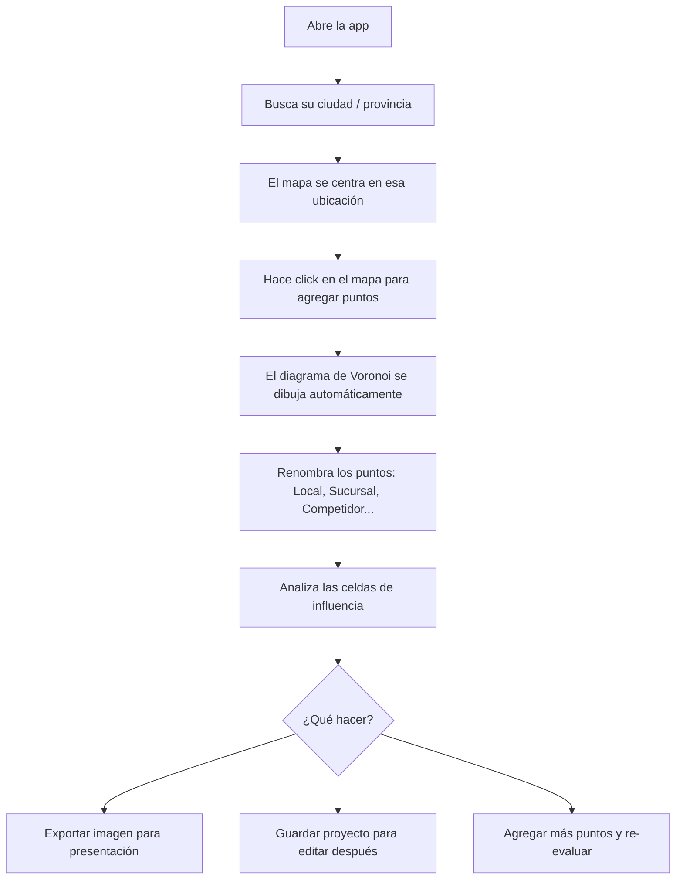

# 🗺️ Voronoi Diagrams — Planificación del Proyecto

## Visión General

Aplicación web interactiva que permite a negocios o locales comerciales visualizar **diagramas de Voronoi** sobre un mapa real para analizar zonas de influencia, cobertura y oportunidades de expansión publicitaria.

---

## 🎯 Objetivo del Producto

Un negocio puede:
1. Buscar su ubicación en el mapa
2. Colocar puntos (sucursales, locales, competencia, zonas de interés)
3. Ver el diagrama de Voronoi generado automáticamente
4. Identificar las **células de influencia** de cada punto
5. Tomar decisiones sobre dónde hacer publicidad o expandirse

---

## 🧱 Stack Tecnológico

### Frontend
| Tecnología | Rol |
|---|---|
| **Next.js 14 (App Router)** | Framework principal |
| **TypeScript** | Tipado estático |
| **Tailwind CSS** | Estilos |
| **Shadcn/ui** | Componentes UI |

### Mapas e Integración
| Tecnología | Rol |
|---|---|
| **Leaflet** | Mapa base interactivo (100% gratuito, sin API Key) |
| **OpenStreetMap** | Tiles del mapa base (gratuitos y open-source) |
| **`react-leaflet`** | Wrapper React oficial para Leaflet |
| **Nominatim API** | Geocodificación/búsqueda de ubicaciones (gratuita, sin Key) |

### Voronoi Engine
| Tecnología | Rol |
|---|---|
| **`d3-delaunay`** (D3.js) | Cálculo del diagrama de Voronoi (algoritmo de Delaunay) |
| **`SVG overlay` via react-leaflet** | Renderizado del diagrama sobre el mapa |

### Estado y Datos
| Tecnología | Rol |
|---|---|
| **Zustand** | Estado global de los puntos y configuración |
| **localStorage / IndexedDB** | Persistencia local de proyectos guardados |

### Deploy
| Tecnología | Rol |
|---|---|
| **Vercel** | Hosting (ideal para Next.js) |
| **Sin variables de entorno** | No requiere API Keys — cualquiera puede clonar y correr |

---

## 🏗️ Arquitectura del Proyecto

```
voronoi-diagrams/
├── app/
│   ├── layout.tsx              # Layout global
│   ├── page.tsx                # Home / Landing
│   └── map/
│       └── page.tsx            # Página principal del mapa
├── components/
│   ├── map/
│   │   ├── MapContainer.tsx    # Leaflet wrapper (react-leaflet)
│   │   ├── VoronoiOverlay.tsx  # SVG overlay del diagrama de Voronoi
│   │   ├── PointMarker.tsx     # Marcadores customizados con Leaflet
│   │   └── SearchBar.tsx       # Búsqueda de ubicación (Nominatim)
│   ├── sidebar/
│   │   ├── PointList.tsx       # Lista de puntos colocados
│   │   ├── PointEditor.tsx     # Editar nombre/color de un punto
│   │   └── ProjectControls.tsx # Guardar / exportar proyecto
│   └── ui/                     # Shadcn components
├── lib/
│   ├── voronoi.ts              # Lógica de cálculo con d3-delaunay
│   ├── projection.ts           # Conversión lat/lng ↔ px con Leaflet
│   └── nominatim.ts            # Helpers para búsqueda con Nominatim API
├── store/
│   └── useMapStore.ts          # Zustand: puntos, configuración
├── types/
│   └── index.ts                # Tipos: Point, VoronoiCell, Project
└── public/
```

---

## 🗂️ Módulos Principales

### 1. Módulo de Mapa (`MapContainer`)
- Inicializa Leaflet con `react-leaflet` usando tiles de OpenStreetMap
- Detecta clicks en el mapa → agrega un nuevo punto
- Permite arrastrar marcadores (`draggable`) para reposicionarlos
- Coordina la capa SVG de Voronoi encima del mapa mediante `useMap()`
- **Sin API Key necesaria** — funciona directamente al instalar las dependencias

### 2. Módulo de Voronoi (`VoronoiOverlay`)
Este es el núcleo técnico del proyecto.

**Flujo:**
1. Obtiene la lista de puntos `[{ lat, lng, id, color }]`
2. Convierte coordenadas geográficas a píxeles del canvas usando la proyección de Leaflet:
   ```ts
   const map = useMap(); // hook de react-leaflet
   const point = map.latLngToContainerPoint([lat, lng]);
   ```
3. Calcula el diagrama con `d3-delaunay`:
   ```ts
   import { Delaunay } from "d3-delaunay";

   const points = [[x1, y1], [x2, y2], ...];
   const delaunay = Delaunay.from(points);
   const voronoi = delaunay.voronoi([0, 0, width, height]);
   ```
4. Dibuja las celdas en un `<svg>` superpuesto al mapa con opacidad y colores por punto (usando `<SVGOverlay>` de react-leaflet)
5. Re-calcula al mover el mapa (zoom, pan) escuchando el evento `moveend` de Leaflet

**Proyección de coordenadas:**
Leaflet expone `map.latLngToContainerPoint(latlng)` que permite convertir coordenadas geográficas a píxeles del contenedor. Esto mantiene el SVG sincronizado con el mapa en todo momento.

### 3. Módulo de Búsqueda (`SearchBar`)
- Usa la **Nominatim API** (de OpenStreetMap) para buscar ubicaciones con texto libre
- Endpoint: `https://nominatim.openstreetmap.org/search?q=...&format=json`
- Al seleccionar un resultado, mueve el mapa a esa ubicación con `map.flyTo()`
- **Completamente gratuita**, sin API Key

### 4. Módulo de Puntos (`PointList` + `PointEditor`)
- Cada punto tiene: `id`, `lat`, `lng`, `name`, `color`, `category`
- Se puede renombrar (ej: "Sucursal Norte", "Competidor A")
- Se puede asignar categoría y color
- Hovear un item en la lista resalta la celda en el SVG

### 5. Módulo de Proyectos (`ProjectControls`)
- Guardar el estado actual en `localStorage`
- Exportar como imagen (usando `html2canvas` o similar sobre el contenedor del mapa)
- Exportar lista de puntos como CSV

---

## 📐 Algoritmo de Voronoi — Detalle Técnico

El diagrama de Voronoi se basa en la **triangulación de Delaunay** (dual del diagrama):

1. **Input**: N puntos en el plano 2D
2. **Triangulación de Delaunay**: conecta los puntos minimizando los triángulos "delgados"
3. **Diagrama dual**: los circuncentros de los triángulos son los vértices de las celdas de Voronoi
4. **Output**: N polígonos donde cada uno contiene todos los puntos más cercanos a su sitio

**`d3-delaunay`** implementa esto en O(n log n) con el algoritmo de Bowyer-Watson.

> 🔑 **El reto principal**: La proyección lat/lng → píxeles debe ser perfectamente consistente con el viewport actual del mapa (zoom + center). Cada vez que el mapa se mueve, hay que redibujar el SVG escuchando el evento `moveend` de Leaflet.

---

## 🚀 Fases de Desarrollo

### Fase 1 — Setup & Mapa Base (2-3 hs)
- [ ] Crear proyecto Next.js + TypeScript + Tailwind
- [ ] Instalar `react-leaflet` y `leaflet`
- [ ] Renderizar mapa básico con tiles de OpenStreetMap
- [ ] Click en el mapa → agregar marcador
- [ ] Configurar fix de SSR para Leaflet (`dynamic import` con `ssr: false`)

### Fase 2 — Voronoi Engine (3-4 hs)
- [ ] Instalar `d3-delaunay`
- [ ] Implementar `projection.ts` usando `map.latLngToContainerPoint()`
- [ ] SVG overlay sincronizado con el mapa (`SVGOverlay` de react-leaflet)
- [ ] Dibujado de celdas de Voronoi con colores
- [ ] Re-cálculo en evento `moveend` del mapa

### Fase 3 — UI & Features (2-3 hs)
- [ ] Sidebar con lista de puntos
- [ ] Editar nombre y color de cada punto
- [ ] Barra de búsqueda con Nominatim API
- [ ] Hover effect: resaltar celda

### Fase 4 — Persistencia & Export (1-2 hs)
- [ ] Guardar/cargar proyectos en localStorage
- [ ] Exportar como imagen PNG
- [ ] Exportar puntos como CSV

### Fase 5 — Polish & Deploy (1-2 hs)
- [ ] Diseño responsivo
- [ ] Landing page explicativa
- [ ] Deploy en Vercel (sin variables de entorno necesarias)

---

## ⚠️ Consideraciones Importantes

> [!IMPORTANT]
> **Sin API Keys**: Este proyecto usa Leaflet + OpenStreetMap + Nominatim, todos 100% gratuitos y open-source. Cualquier persona puede clonar el repositorio y correr `npm install && npm run dev` sin configurar nada.

> [!WARNING]
> **SSR con Leaflet**: Leaflet accede a `window` directamente, lo que rompe el Server Side Rendering de Next.js. El componente `MapContainer` debe importarse con `dynamic(() => import(...), { ssr: false })` para evitar errores.

> [!WARNING]
> **Proyección del canvas**: Es el punto técnicamente más complejo. El SVG debe ser exactamente del mismo tamaño que el mapa y debe recalcularse en cada evento `moveend` de Leaflet (cuando termina de moverse/zoom).

> [!TIP]
> **Nominatim Rate Limit**: La API de Nominatim tiene un límite de 1 request/segundo. Para la barra de búsqueda, usá debounce de al menos 500ms para no spamear el servicio.

---

## 📦 Dependencias Clave

```json
{
  "dependencies": {
    "next": "^14",
    "leaflet": "^1.9",
    "react-leaflet": "^4",
    "@types/leaflet": "^1.9",
    "d3-delaunay": "^6",
    "zustand": "^4",
    "shadcn-ui": "latest"
  }
}
```

---

## 🔄 Flujo de Usuario Final



---

## 💡 Features Extras (v2)

- **Heatmap de densidad**: zonas con más puntos = más saturadas
- **Radio de influencia**: círculos de N km alrededor de cada punto
- **Análisis de gaps**: detectar zonas sin cobertura automáticamente
- **Multi-capa**: separar puntos propios de competidores en capas
- **Compartir por link**: serializar el estado en la URL
